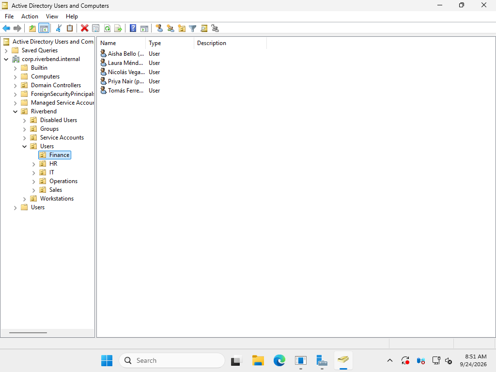
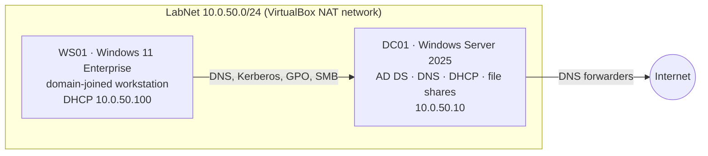

# Riverbend AD Lab — Active Directory service desk, built and operated

A working Windows domain for a fictional 16-person company, **Riverbend Logistics**, built entirely from PowerShell scripts and then used to work eight service-desk tickets end to end: onboarding, password reset, lockout investigation, permissions, transfer, offboarding, access audit and a failed domain join.

Every ticket was reproduced in the lab, and every claim links to captured output in [`evidence/`](evidence/). Nothing here is a screenshot of a tutorial.

## What's in the lab

| Area | What was built |
|---|---|
| **Domain** | `corp.riverbend.internal` (NetBIOS `RIVERBEND`), single DC, AD-integrated DNS with forwarders and a reverse zone |
| **DHCP** | Scope `10.0.50.100–200` on the DC, handing out the DC as DNS. The hypervisor's own DHCP was switched off (see [RB-1008](tickets/RB-1008-domain-join-dns.md)) |
| **OU design** | `Riverbend\Users\<Department>`, `Workstations`, `Groups\Role`, `Groups\Resource`, `Service Accounts`, `Disabled Users`. New PCs are redirected to `Workstations` so GPOs apply on join |
| **Groups (AGDLP)** | Users → `GG-<Dept>` (global) → `DL-Share-<Dept>-RW/RO` (domain local) → NTFS ACL. Only resource groups ever appear on a folder |
| **Accounts** | 15 employees bulk-created from an HR CSV (accents stripped, duplicate names handled: `maria.gonzalez` / `maria.gonzalez2`), random temp passwords, change forced at first logon |
| **File shares** | One share per department + Public, access-based enumeration on (users don't see folders they can't open) |
| **Password policy** | 12+ characters, complexity, 12 remembered, lockout after 5 attempts for 15 minutes |
| **GPO: WS - Security Baseline** | 10-minute screen lock, logon banner, last username hidden, USB storage write-blocked, firewall on for all profiles, wait-for-network at logon. Each value verified on WS01 ([evidence](evidence/gpo-baseline-applied-ws01.txt), [banner](evidence/gpo-logon-banner.png)) |
| **GPO: USR - Drive Maps** | One GPO maps all department drives with Group Policy Preferences item-level targeting by group |
| **DC auditing** | Kerberos / NTLM failures, account and group changes, logons. Enabled after the lockout ticket exposed the gap |

## The tickets

| Ticket | Scenario | What it shows |
|---|---|---|
| [RB-1001](tickets/RB-1001-new-hire-onboarding.md) | New hire in Finance | Onboarding with one command, then **verified from the user's own first logon**: forced password change, F: and P: mapped, nothing else |
| [RB-1002](tickets/RB-1002-password-reset.md) | Forgotten password | Identity verification before a reset; the tool refuses to run without recording how identity was checked |
| [RB-1003](tickets/RB-1003-account-lockout.md) | Account keeps locking | Event log trail (4771 → 4740) traced to the source PC; **unlock, not reset**; auditing gap found and fixed |
| [RB-1004](tickets/RB-1004-access-denied-by-design.md) | "Access denied" saving a file | Reproduced as the user, permission chain traced; closed as by-design and routed to the data owner |
| [RB-1005](tickets/RB-1005-department-transfer.md) | Transfer Operations → Finance | Old access removed rather than accumulated; duplicate request refused |
| [RB-1006](tickets/RB-1006-offboarding.md) | Leaver | Memberships saved, then disabled, scrambled, stripped, moved; logon verified to fail |
| [RB-1007](tickets/RB-1007-stale-account-audit.md) | Monthly access review | Report separates real findings (service account with non-expiring password) from expected noise |
| [RB-1008](tickets/RB-1008-domain-join-dns.md) | PC can't join the domain | **Happened for real during the build**: rogue DHCP handing out a public DNS; fixed at the source |

## The tooling

[`tools/Riverbend.HelpDesk.psm1`](tools/Riverbend.HelpDesk.psm1) is a small PowerShell module with the day-to-day account work a service desk does:

| Function | Purpose |
|---|---|
| `New-RiverbendUser` | Onboard one employee: naming rules, department OU, role groups, temp password |
| `Reset-RiverbendPassword` | Reset + unlock + force change; requires `-IdentityVerifiedBy`, refuses disabled accounts |
| `Get-LockoutSource` | Reads 4740 / 4771 / 4776 on the DC and shows where failed logons come from |
| `Move-RiverbendUserDepartment` | Mover: swap groups, attributes and OU |
| `Invoke-RiverbendOffboarding` | Leaver: save memberships, disable, scramble, strip, park in `Disabled Users` with a purge date |
| `Get-StaleAccountReport` | Monthly hygiene: inactive, never used, non-expiring passwords, overdue purges |

Every change it makes goes to an audit log (`C:\HelpDesk\Logs\audit.csv`) with the ticket number, so "who changed this, when, and why" always has an answer.

## Security decisions worth calling out

- **Least privilege on shares:** share permissions are broad, NTFS decides, and only resource groups appear on ACLs. Sales can read Finance's price list and cannot change it ([RB-1004](tickets/RB-1004-access-denied-by-design.md)).
- **Temporary passwords never go in a ticket or an email.** The bulk import writes them to a handoff file on the server only.
- **Disable, don't delete** leavers for 30 days. That keeps the audit trail and gives time to hand over files.
- **Auto-logon removed.** The unattended Windows install left `AutoAdminLogon` switched on for the lab admin on both machines. Found during testing and turned off ([evidence](evidence/hardening-autologon.txt)).
- **Logon banner and hidden last username:** small settings, but a lock screen shouldn't give away half of someone's credentials.

## How it was built

Two VirtualBox VMs installed unattended from Microsoft's evaluation ISOs. Every configuration step is a script in [`setup/`](setup/), run inside the VMs from the host through VirtualBox Guest Additions ([`host/LabHost.psm1`](host/LabHost.psm1)):

| Step | Script | Runs on |
|---|---|---|
| 1 | [`01-Set-DCNetwork.ps1`](setup/01-Set-DCNetwork.ps1) — static IP | DC01 |
| 2 | [`02-Install-ADForest.ps1`](setup/02-Install-ADForest.ps1) — AD DS + DNS, new forest | DC01 |
| 3 | [`03-Set-DnsAndDhcp.ps1`](setup/03-Set-DnsAndDhcp.ps1) — forwarders, reverse zone, DHCP scope | DC01 |
| 4 | [`04-New-OUStructure.ps1`](setup/04-New-OUStructure.ps1) — OUs, AGDLP groups, computer redirect | DC01 |
| 5 | [`05-Import-NewHires.ps1`](setup/05-Import-NewHires.ps1) — bulk onboarding from [`data/new-hires.csv`](data/new-hires.csv) | DC01 |
| 6 | [`06-New-DepartmentShares.ps1`](setup/06-New-DepartmentShares.ps1) — shares + NTFS | DC01 |
| 7 | [`07-New-BaselineGPOs.ps1`](setup/07-New-BaselineGPOs.ps1) — password policy, both GPOs | DC01 |
| 8 | [`08-Enable-DCAuditing.ps1`](setup/08-Enable-DCAuditing.ps1) — audit subcategories | DC01 |
| 10 | [`10-Join-Domain.ps1`](setup/10-Join-Domain.ps1) — DNS pre-check, then join | WS01 |

All scripts target Windows PowerShell 5.1 (what ships with Windows). Steps 3, 4, 6, 7 and 8 are safe to re-run. Steps 2 and 5 are one-time: step 2 creates the forest, and re-running step 5 would onboard the same people again with numbered login names.

## Honest limitations

- **Two machines, one DC.** No replication, no second site, no failover. A real domain has at least two DCs.
- **File shares live on the DC.** Fine for a lab; in production they belong on a file server.
- **Test users.** To run tickets as real users from WS01, four accounts were given a known lab password, standing in for employees who had already completed their first logon. Only the RB-1001 new hire went through the full first-logon flow.
- **Open item:** reverse DNS records for DHCP clients are not being registered ([RB-1003](tickets/RB-1003-account-lockout.md#open-follow-up)). Left documented as open rather than hidden.
- **Aging can't be simulated.** The 90-day inactivity rule in the audit is implemented, but a lab built today has no genuinely stale accounts to prove it on.
- **Build quirks** (VirtualBox on a Hyper-V host): the EFI "press any key to boot from DVD" prompt needs a keystroke, both VMs occasionally hung on restart and needed a hard reset, and Windows 11's built-in Administrator had to be enabled once through an interactive UAC prompt before remote automation could run elevated.
- **No Entra ID / Intune / Microsoft 365.** Everything here is on-premises Active Directory. The cloud side needs a tenant and is a separate project.

## Stack

Windows Server 2025 (evaluation) · Windows 11 Enterprise (evaluation) · Active Directory Domain Services · DNS · DHCP · Group Policy (incl. Preferences) · SMB/NTFS · Windows PowerShell 5.1 · VirtualBox 7.2
