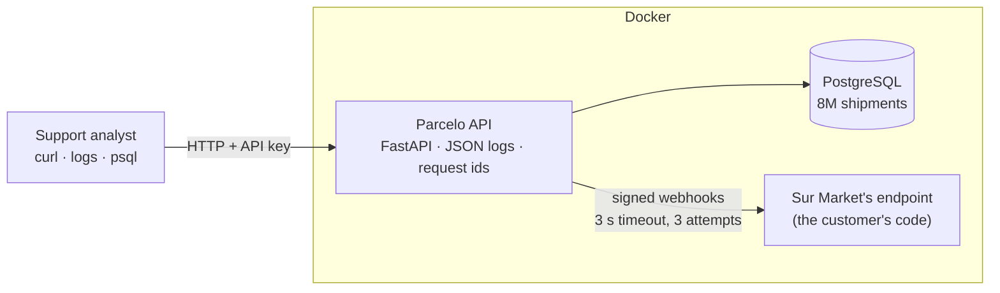

# Parcelo — SaaS technical support lab

A small but real SaaS API (shipment tracking for online shops) running in Docker, with **eight support tickets worked end to end**. Each one is reproduced with the same tools a technical support analyst uses: `curl`, the API's structured logs, the request id and read-only SQL. Each ends with the reply to the customer and, when it's our bug, an engineering escalation.

The point of the lab is the judgment in the middle: **is this the customer's integration, our configuration, or our bug?** Six tickets are customer-side or by design, and two are product bugs. Telling them apart quickly, and proving it, is most of the job.

## The tickets

| Ticket | Customer says | What it really was | Outcome |
|---|---|---|---|
| [PS-1001](tickets/PS-1001-invalid-api-key.md) | "Our API key doesn't work" (401) | Key sent wrapped in quotes, found from the request id: logged length 35 vs 33, prefix starts with `"` | Customer config |
| [PS-1002](tickets/PS-1002-read-only-key.md) | "We can read but can't create" (403) | Integration uses their read-only key; they already have a write key | Customer config |
| [PS-1003](tickets/PS-1003-comma-decimal.md) | "The API rejects our weights" (422) | `"2,5"`: Argentine decimal comma, sent as a string. Answered in Spanish | Customer data + feature request |
| [PS-1004](tickets/PS-1004-rate-limit.md) | "You block us every night" (429) | Sync with no backoff; `Retry-After` shown and tested | Customer retry logic |
| [PS-1005](tickets/PS-1005-duplicate-webhooks.md) | "Every webhook arrives 3 times" | Their endpoint replies after 4 s vs our 3 s timeout → at-least-once retries | By design; idempotency guidance |
| [PS-1006](tickets/PS-1006-webhook-signature.md) | "Signature fails, only sometimes" | **Our bug:** we sign ASCII-escaped JSON but send UTF-8. Only accented payloads fail | **Escalated → [ENG-2041](tickets/ENG-2041-signature-non-ascii.md)** |
| [PS-1007](tickets/PS-1007-report-timeout.md) | "The report always times out" (504) | **Our bug:** missing index → full scan of 8M rows. Fix tested in a rolled-back transaction: 159 ms → 23 ms | **Escalated → [ENG-2042](tickets/ENG-2042-report-missing-index.md)** |
| [PS-1008](tickets/PS-1008-pagination.md) | "Dashboard says 60, API gives 50" | Reading only page 1 of a paginated list | How it works |

Every ticket has a script in [`scenarios/`](scenarios/) that reproduces it and its captured output in [`evidence/`](evidence/). The ticket quotes are copied from that output, not written from memory.

## What's running



| Piece | Details |
|---|---|
| **API** ([`app/parcelo`](app/parcelo)) | FastAPI + psycopg. API keys stored as SHA-256 hashes, with read/write scopes, a per-key rate limit and throttling of failed authentication per client. Cursor pagination, input validation, signed webhooks with retries, a daily report with a time budget |
| **Logs** | One JSON line per event, all carrying the `request_id` returned to the client in `X-Request-Id`. Auth failures log the key's first 12 characters and its length, never the key |
| **Database** | PostgreSQL 16. Five customer accounts; MegaEnvíos has 8M shipments to make performance problems real |
| **Customer simulator** ([`customer-sim`](customer-sim/app.py)) | Sur Market's webhook receiver, written the way a customer would: correct signature check, but it processes before replying and doesn't de-duplicate |
| **Tests** ([`app/tests`](app/tests)) | 23 pytest tests against a real Postgres, including failed-auth throttling and a 500 that still returns a request id. The two product bugs are **strict `xfail` tests** named after their ENG tickets, so the fix is done when they turn green |

## Two things worth pointing out

**Distinguishing "customer" from "us" with evidence, not opinion.** PS-1006 is a good example. "Signature fails sometimes" sounds like the customer's code. Checking the pattern across their events showed that every rejected event, and only those, contained a non-ASCII character. That narrowed it to encoding, and comparing the two serializations proved it was ours. The customer was told so directly, with a workaround that doesn't involve turning off security.

**Support doesn't change production, but can hand engineering a nearly finished fix.** PS-1007's index was tested inside a transaction that was rolled back, so the escalation includes the before/after query plans and the exact `CREATE INDEX CONCURRENTLY` statement, and nothing changed.

## Running it

Requires Docker.

```bash
docker compose up -d --build        # first boot seeds the data (~1 min for 8M rows)
bash scenarios/ps-1001-invalid-key.sh   # any scenario, 1001-1008
docker compose run --rm --no-deps api pytest -q
```

API keys and the webhook secret are generated at first boot into `shared/lab-keys.json` (git-ignored). The scenario scripts read them from there and redact them in everything they print. The only credential in the repo is the local Postgres password in `docker-compose.yml`; the database is bound to `127.0.0.1` only.

## Honest limitations

- **Scaled down.** 8M rows and a 150 ms report budget stand in for a much bigger table with a multi-second timeout. The ratio (full scan vs index, ~7×) is the real finding, not the absolute milliseconds.
- **One API process.** The rate limiter keeps its counters in memory; several API instances would need a shared store like Redis.
- **Webhooks are delivered from a background task in the same process**, not from a queue. Fine for a lab; in production a crash mid-retry would lose the remaining attempts.
- **The two bugs are deliberate** and marked in the code with a comment pointing at their ticket. The rest of the code is meant to be correct.
- **Customer conversations are written, not real.** The technical side of every ticket (requests, logs, queries, plans) was reproduced; the customer messages are the kind of report that would lead to it.

## Stack

Python 3.12 · FastAPI · PostgreSQL 16 · psycopg 3 · httpx · pytest · Docker Compose · bash + curl
